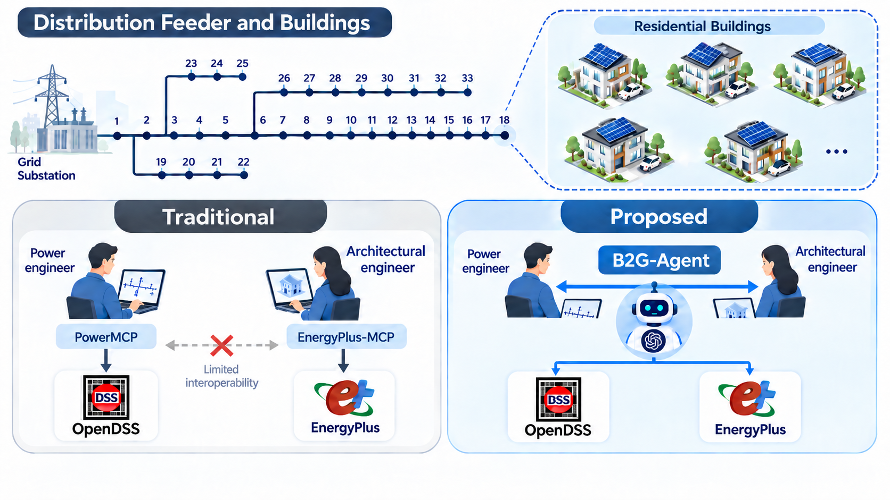
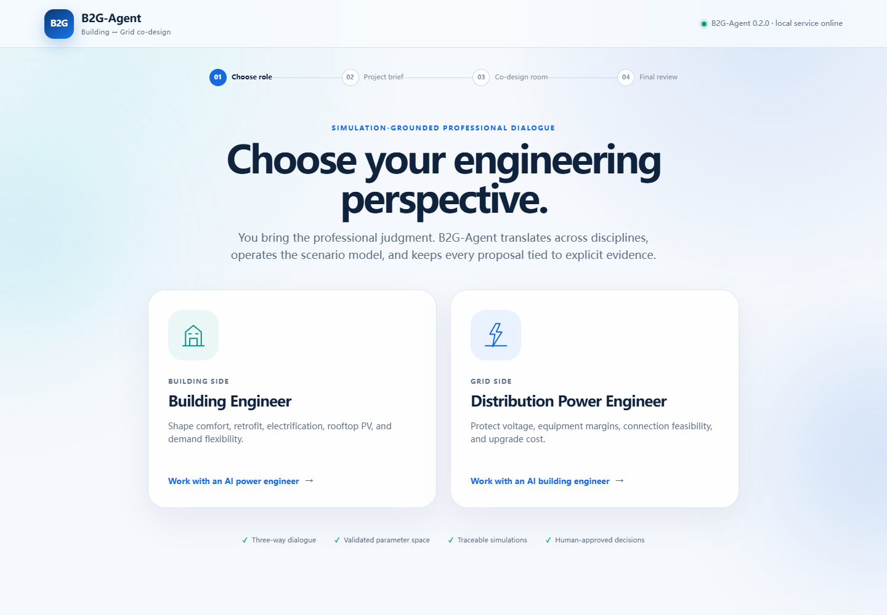
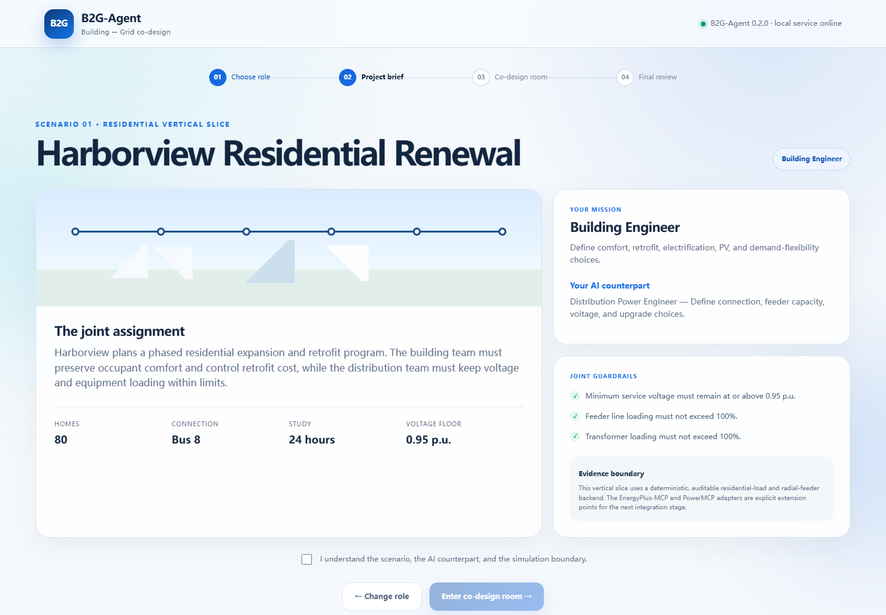
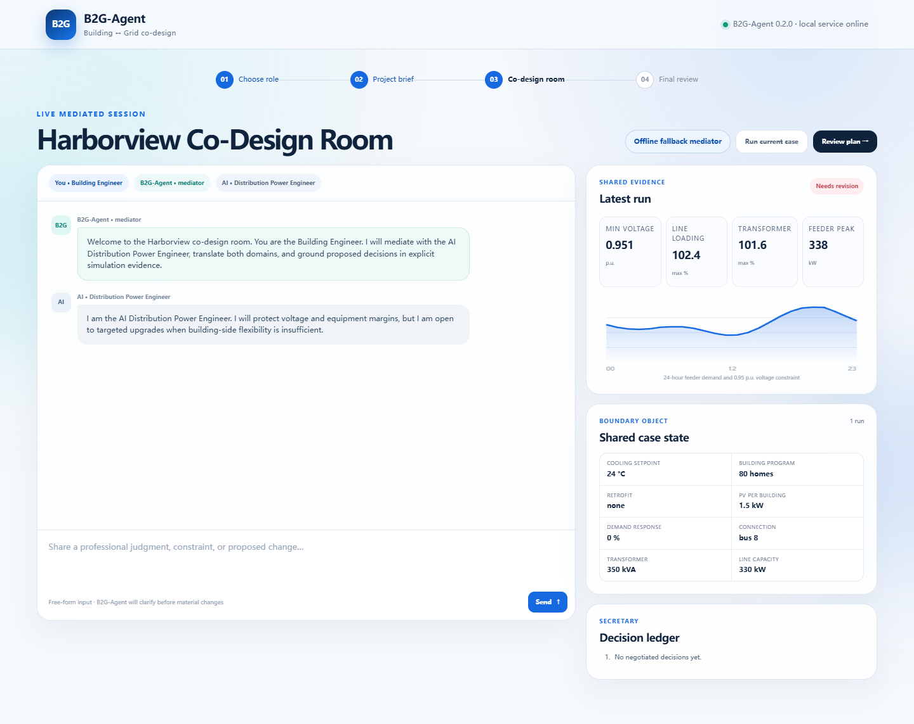
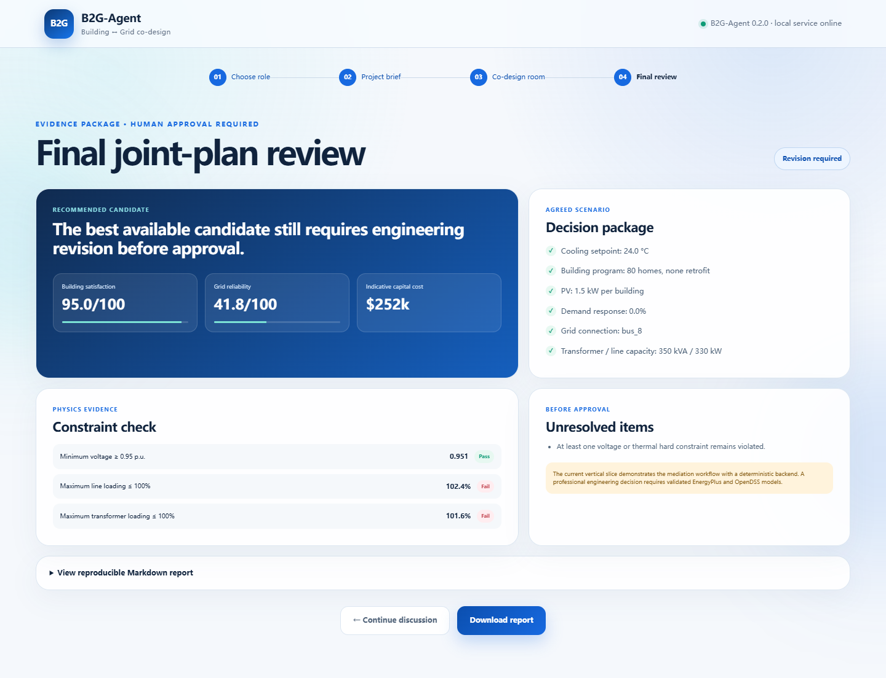

# B2G-Agent

**A simulation-grounded AI mediator for building–grid co-design.**

B2G-Agent helps building engineers and distribution power engineers collaborate without requiring either person to master the other discipline's terminology or simulation software. It interprets free-form professional input, translates it into a shared engineering case, decides when evidence is needed, runs a validated scenario backend, explains the consequences to both sides, and records the path to a joint plan.



## Why B2G-Agent

### 1. Cross-domain professional mediation

B2G-Agent performs three kinds of translation:

- **Language translation:** explains each discipline's terminology in the other engineer's decision context.
- **Model translation:** maps natural language to validated building and grid parameters.
- **Impact translation:** converts simulation evidence into consequences the counterpart can act on.

### 2. Natural-language simulation delegation

Engineers state goals, constraints, preferences, and proposed changes. The LLM interprets the message and proposes a structured action plan; typed schemas validate the plan; deterministic code applies allowed changes; the simulation backend computes the evidence; and the LLM explains the result. The LLM never fabricates engineering metrics.

## Current Vertical Slice

The runnable web application implements the **Harborview Residential Renewal** scenario:

1. Choose to participate as a Building Engineer or Distribution Power Engineer.
2. Review a constrained 80-home expansion and retrofit brief.
3. Negotiate with an AI counterpart inside a three-way co-design room.
4. Compare building comfort, grid reliability, voltage, equipment loading, and indicative cost.
5. Produce a traceable final-plan Markdown report for human review.

The current scenario exposes eight validated decisions: cooling setpoint, building count, retrofit level, rooftop PV, demand response, connection bus, transformer capacity, and line capacity.

> **Evidence boundary:** the vertical slice currently uses a transparent deterministic residential-load and radial-feeder backend. It demonstrates the complete mediation, tool-planning, evidence, and decision workflow, but it is not a calibrated EnergyPlus/OpenDSS engineering study. EnergyPlus-MCP and PowerMCP are the next validated backend integrations; the legacy single-building workflow already supports direct EnergyPlus and OpenDSS execution.

## Interface Preview

The complete local experience has four stages. These screenshots were captured from the offline fallback mode, so no API key is required to reproduce them.

| 1. Choose an engineering role | 2. Review the project brief |
|---|---|
|  |  |

| 3. Enter the co-design room | 4. Review the joint plan |
|---|---|
|  |  |

## Quick Start

Python 3.11 or newer and Git are required. EnergyPlus, OpenDSS, Node.js, and an API key are **not** required for the four-stage offline demo.

### Windows PowerShell

```powershell
git clone https://github.com/cuixueyuan/B2G-Agent.git
Set-Location B2G-Agent
py -3.11 -m venv .venv
.\.venv\Scripts\Activate.ps1
python -m pip install --upgrade pip
python -m pip install -e ".[dev]"
Copy-Item .env.example .env
b2g-web
```

### macOS or Linux

```bash
git clone https://github.com/cuixueyuan/B2G-Agent.git
cd B2G-Agent
python3 -m venv .venv
source .venv/bin/activate
python -m pip install -e ".[dev]"
cp .env.example .env
b2g-web
```

Open [http://127.0.0.1:8000](http://127.0.0.1:8000). Stop the local service with `Ctrl+C`.

The copied `.env` starts with `B2G_LLM_ENABLED=false`, so the complete interface and deterministic scenario run locally without contacting an LLM provider.

### Enable the LLM mediator with your own API key

Stop the service, edit the local `.env`, and replace the values below:

```dotenv
OPENAI_API_KEY=your_own_api_key_here
B2G_MODEL=gpt-4.1-mini
B2G_LLM_ENABLED=true
```

Restart `b2g-web` after saving the file. The real `.env` is ignored by Git and must never be committed. The key is loaded only by the Python server; it is never returned by an API endpoint or sent to the browser.

For environment verification, alternative launch commands, tests, common Windows issues, and troubleshooting, see the [complete local deployment guide](docs/local-deployment.md).

## Interaction Model

```text
Free-form engineer message
        ↓
Role-aware LLM interpretation
        ↓
Validated parameter/action schema ──→ clarify or request confirmation
        ↓
Building / grid / coupled simulation decision
        ↓
Deterministic execution and constraint verification
        ↓
Audience-specific translation + AI counterpart response
        ↓
Decision ledger → scenario comparison → final human review
```

The three speakers are deliberately separate:

- **Human engineer:** owns professional intent and final approval.
- **AI counterpart:** represents the other discipline's scenario-defined objectives and constraints.
- **B2G-Agent mediator:** interprets, translates, runs evidence, manages the discussion, and records decisions.

## Architecture

```text
Browser UI
  └─ FastAPI session service
      ├─ Conversation governor and confirmation policy
      ├─ LLM mediator (structured JSON only)
      ├─ Shared B2G case state
      ├─ ResidentialCommunitySimulator (current vertical backend)
      ├─ EnergyPlus / OpenDSS legacy adapters
      ├─ EnergyPlus-MCP / PowerMCP extension boundary
      └─ Session artifacts and final decision report
```

See [architecture.md](docs/architecture.md), [vertical-scenario.md](docs/vertical-scenario.md), [capability-matrix.md](docs/capability-matrix.md), and [security.md](docs/security.md).

## API Endpoints

- `GET /api/health` — local service status.
- `GET /api/scenario` — scenario brief and allowed decision space.
- `POST /api/sessions` — create a role-aware session.
- `POST /api/sessions/{id}/messages` — mediate one free-form turn.
- `POST /api/sessions/{id}/simulate` — rerun the current shared case.
- `POST /api/sessions/{id}/finalize` — select and report the best available candidate.

Interactive API documentation is available at `/docs` while the service is running.

## Existing Simulation Workflows

The earlier deterministic workflow remains available:

```bash
python samples/single-building-to-grid/scripts/run_building_to_grid.py \
  --config samples/single-building-to-grid/configs/building_to_grid.yaml
```

The archived samples include:

- `samples/single-building-to-grid`: mock or real EnergyPlus-to-OpenDSS coupling.
- `samples/building-cluster-to-grid`: deterministic 50-building synthetic cluster; the ResStock backend remains scaffold-only.

## Testing

```bash
pytest
```

Unit tests never require a real API key, EnergyPlus, or OpenDSS execution. They cover the existing coupling workflow, EnergyPlus parsing, OpenDSS behavior, LLM action validation, the new residential vertical simulator, collaboration sessions, and the web API.

## Repository Layout

```text
src/b2g_agent/
  collaboration/       # roles, shared state, mediator, scenario, and session logic
  web/                 # FastAPI app and four-stage browser interface
  agents/              # existing deterministic workflow agents
  tools/               # EnergyPlus/OpenDSS wrappers and data utilities
  cases/               # reusable workflow orchestration
samples/               # archived single-building and cluster examples
docs/                  # architecture, scenario, capability, and security documentation
tests/                 # unit and API tests
```

## External Ecosystem

B2G-Agent is designed to orchestrate, not duplicate, the domain tool ecosystems:

- [PowerMCP](https://github.com/Power-Agent/PowerMCP), maintained by the Harvard Power and AI Initiative, provides MCP servers for OpenDSS and other power-system tools.
- [EnergyPlus-MCP](https://github.com/LBNL-ETA/EnergyPlus-MCP), developed by Lawrence Berkeley National Laboratory, provides MCP tools for EnergyPlus model inspection, modification, execution, and analysis.

Those projects retain their own licenses and attribution. They are not vendored into this repository.

## Roadmap

- Validate thermostat and schedule modification through EnergyPlus-MCP.
- Connect PowerMCP/OpenDSS for feeder compilation, scenario edits, and QSTS analysis.
- Add a capability registry that selects MCP tools only when required actions are supported.
- Add a real two-human collaboration mode alongside the current human-plus-NPC mode.
- Add scenario comparison, sensitivity analysis, and multi-objective trade-off views.
- Evaluate communication accuracy, tool-selection accuracy, time to feasible agreement, reproducibility, and professional trust.

## Citation

```bibtex
@software{b2g_agent,
  title  = {B2G-Agent: A Simulation-Grounded AI Mediator for Building--Grid Co-Design},
  author = {Xueyuan Cui},
  year   = {2026},
  url    = {https://github.com/cuixueyuan/B2G-Agent}
}
```

## License

Released under the MIT License. External simulators and MCP servers are governed by their respective licenses.
